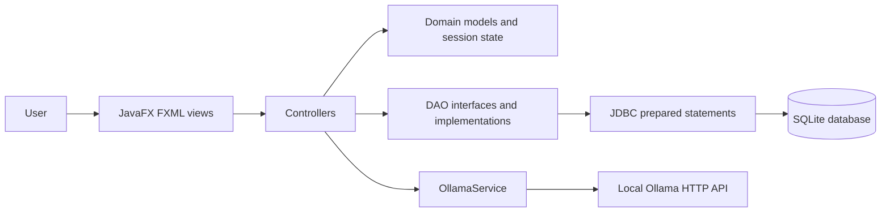
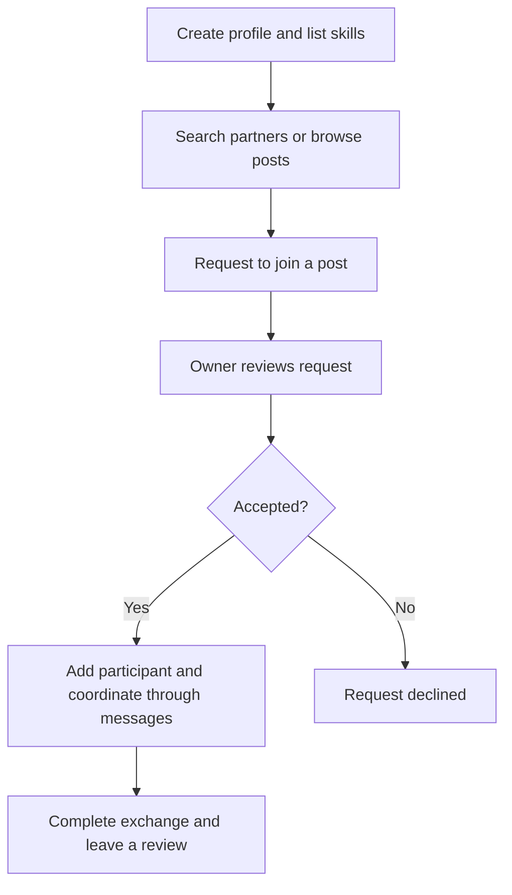

# SkillDev — Skill Exchange Desktop Application

**Java 21 · JavaFX/FXML · SQLite/JDBC · Maven · JUnit 5 · optional Ollama**

SkillDev connects people who want to teach a skill with people who want to learn one. Users maintain profiles, list teaching and learning skills, discover partners, publish posts, request to join exchanges, message other users, and leave reviews.

Zain Khokhar originated the application concept. This repository contains the implementation developed with collaborators for QUT CAB302; individual contributions are recorded in Git history.

## Explore the application

| Capability | Implementation |
| --- | --- |
| Profiles | Profile images, biography, location, teaching/learning skills, hobbies and reviews |
| Discovery | Name/username/skill search and partner comparison |
| Exchanges | Posts, participant limits, join requests and request status changes |
| Communication | Direct/group messaging backed by SQLite |
| Recommendations | Local Ollama prompts for partner recommendations, comparison and scheduling tips |
| Persistence | DAO interfaces and JDBC implementations, with a SQLite database |

## Architecture



The UI and persistence layers are separated through controllers and DAOs. `Launcher` initialises the schema before starting `HelloApplication`. Profile-image files are stored locally, with filenames persisted in the database.

### Exchange workflow



### Zain's contributions

Git history under Zain Khokhar / `khokharzain001@gmail.com` records work on:

- Profile-picture selection and persistence, including database and view integration.
- Reviews on searched profiles and consistent navigation between application views.
- Messaging-screen styling and portable resource paths.
- Join-request DAO tests and integration/merge fixes.

These examples describe personal contributions; the feature table above describes the whole application.

## Run locally

Requirements: JDK 21, a desktop environment and Git. The repository includes a Maven wrapper.

```bash
git clone https://github.com/khokharzain/CAB302-.git
cd CAB302-
bash ./mvnw clean javafx:run
```

On Windows, use `mvnw.cmd clean javafx:run`. Alternatively, import `pom.xml` in a Java IDE and run `com.example.newdesign.Launcher` with the repository root as the working directory.

The application uses `database.db` in the working directory and local `profile_images/`. Use demo data only; the checked-in database is a development artefact.

### Optional local AI

Install Ollama from its official distribution, run its local server, and obtain the model:

```bash
ollama pull llama3.2:1b
```

`OllamaService` calls `http://localhost:11434/api/generate`. AI output is a suggestion generated from profile information, not a guarantee of suitability or availability. The application checks whether the local service is available.

## Tests

```bash
bash ./mvnw test
```

On 1 October 2026, all **86 tests passed** with the corrected runner. The source contains 86 JUnit test methods covering models, validation, matching, messages, posts, participants and join requests. The Maven configuration selects a JUnit 5 compatible Surefire runner. DAO tests use the working-directory database; run them in a disposable checkout rather than against data you need to keep.

## Source guide

```text
src/main/java/com/example/newdesign/
  Launcher.java             schema initialisation and entry point
  HelloApplication.java     JavaFX startup
  controller/               UI events and application workflows
  model/                    domain objects, DAOs, session state, Ollama
src/main/resources/com/example/newdesign/
                            FXML views and bundled assets
src/test/java/com/example/newdesign/
                            JUnit tests
docs/                       generated Javadoc
pom.xml                     dependencies, runner and JavaFX configuration
```

## Scope and next improvements

This is an educational desktop prototype. The current password representation uses Java `hashCode`, which is not a password-hashing algorithm; use synthetic accounts and do not reuse a real password. Before using real account data, replace it with a salted password KDF, isolate test databases, remove bundled development data, and harden AI response parsing and timeouts. SQLite keeps the data on one machine; this is not a multi-user hosted service.
